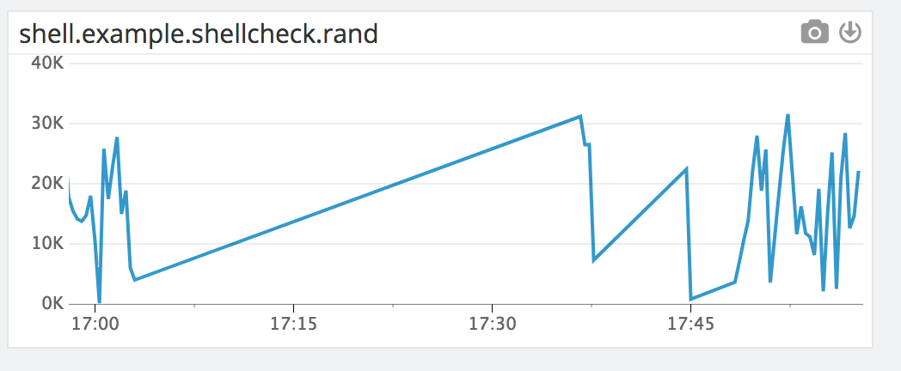

# Custom Check Shell
Spins up a VM using vagrant that installs the Datadog agent on it with a custom check using shell.

# Prerequesites
- [Vagrant](https://www.vagrantup.com/)

# Run
`DD_API_KEY=<YOUR_DD_API_KEY> vagrant up`

# Metrics
Custom metrics will show up in Datadog as `shell.example.shellcheck.rand`


# Looking in
- `vagrant ssh`
- `sudo su -`
- `/etc/init.d/datadog-agent configcheck`
- `/etc/init.d/datadog-agent info`

# Why?
There's an error with using the shell command check as seen below:
```
Python 2.7.3 (default, Apr 20 2012, 22:39:59)
[GCC 4.6.3] on linux2
Type "help", "copyright", "credits" or "license" for more information.
>>> import tempfile
>>> import subprocess
>>> stdout=tempfile.TemporaryFile()
>>> proc = subprocess.Popen("free | grep Mem | awk '{print $3/$2 * 100.0}'", stdout=stdout)
Traceback (most recent call last):
  File "<stdin>", line 1, in <module>
  File "/usr/lib/python2.7/subprocess.py", line 679, in __init__
    errread, errwrite)
  File "/usr/lib/python2.7/subprocess.py", line 1249, in _execute_child
    raise child_exception
OSError: [Errno 2] No such file or directory
```
As it is triggered from:
- https://github.com/DataDog/dd-agent/blob/garner/shell-integration/checks.d/shell.py#L52
- https://github.com/DataDog/dd-agent/blob/master/utils/subprocess_output.py#L28
- https://github.com/python/cpython/blob/2.7/Lib/subprocess.py#L1023

The directory is:
```
>>> import tempfile
>>> tempfile.gettempdir()
'/tmp'
```

This has to do with using pipes (`|`) in the command. If you look at
[data/test.py](./data/test.py) you'll see several commands this was tested with
but I landed on `rand` to actually get it to run. Complex shell commands will
require `shell=True` in the dd-agent utils subprocess code:
https://github.com/DataDog/dd-agent/blob/master/utils/subprocess_output.py#L28.
